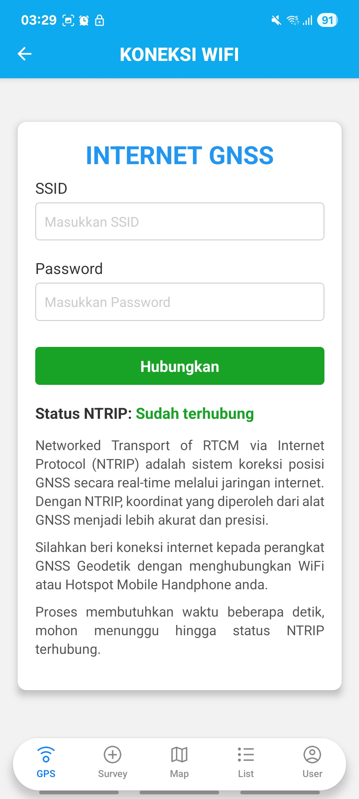

# 🛰️ AIRIS (Aplikasi Pemetaan dan Inventarisasi Jaringan Irigasi Berbasis Mobile GIS)

**AIRIS** adalah aplikasi **Mobile GIS** berbasis **React Native** yang dirancang untuk memetakan jaringan irigasi secara real-time dan akurat. Aplikasi ini terintegrasi dengan perangkat **GNSS Low Cost** dan dikembangkan sebagai bagian dari Proyek Akhir Program Studi Sarjana Terapan Sistem Informasi Geografis Universitas Gadjah Mada.
<br></br>


## 📌 Fitur Utama

### 🔗 Integrasi GNSS Ganda

- Mendukung dua sumber koordinat:
  - **GNSS Geodetik Low Cost** (via Bluetooth)
  - **GNSS Internal Smartphone**
- Opsi memilih sumber koordinat sesuai kondisi lapangan


### 🗺️ Peta Interaktif Jaringan Irigasi

- Menampilkan peta jaringan irigasi (saluran primer, sekunder, tersier) secara interaktif
- Tersedia mode pemetaan:
  - **Pemetaan Bangunan Irigasi (Titik)**
  - **Pemetaan Saluran Irigasi (Garis)**
- Dapat mengimpor data saluran irigasi dalam format **GeoJSON**
- Tampilan layer berbeda sesuai tingkat saluran


### ✏️ Pemetaan Bangunan Irigasi (Titik)

- Merekam koordinat titik secara real-time
- Mencatat atribut lengkap bangunan:
  - Nama bangunan
  - Tipe bangunan
  - Foto dokumentasi
  - Keterangan teknis lainnya
- Data hasil survei titik dapat diekspor ke **CSV** lengkap dengan atributnya


### 📐 Pemetaan Saluran Irigasi (Garis)

- Merekam jalur saluran irigasi sebagai garis (polyline)
- Pengambilan titik otomatis setiap **5 detik**
- Sistem menghitung panjang jalur secara real-time
- Data hasil pemetaan garis dapat diunduh dalam format **GeoJSON**


### ✅ Validasi Topologi Bangunan Irigasi

- Fitur **Topology Rules** untuk validasi:
  - **Bangunan irigasi (titik) harus berada di dalam saluran irigasi (garis)**
- Perhitungan jarak terdekat antara titik dengan garis
- **Batas toleransi jarak**:
  - Saluran Primer: ≤ 5 meter
  - Saluran Sekunder: ≤ 3 meter
  - Saluran Tersier: ≤ 1.5 meter
- Menampilkan notifikasi jika titik di luar toleransi
- Membantu memastikan akurasi spasial survei lapangan

### 📷 Dokumentasi Foto
- Foto dokumentasi setiap titik bangunan
- Foto tersimpan bersama atribut data


### 🔄 CRUD Data Lapangan
- Membuat, mengedit, menghapus data survei langsung dari perangkat mobile
- Update data spasial dan atribut secara real-time

### 📡 RTK NTRIP Support
- Mendukung koreksi posisi GNSS secara real-time via **RTK NTRIP**
- Meningkatkan akurasi koordinat hingga level sentimeter
- Ideal untuk survei presisi tinggi di lapangan

### 💾 Ekspor Data
- **Bangunan irigasi (titik):** Ekspor ke format CSV
- **Saluran irigasi (garis):** Ekspor ke format GeoJSON
- Memudahkan integrasi data ke software GIS lain seperti ArcGIS atau QGIS


## 🎯 Manfaat
- Mempercepat proses pemetaan jaringan irigasi
- Meningkatkan akurasi data spasial
- Mengurangi potensi kesalahan dalam inventarisasi aset irigasi
- Mempermudah monitoring dan pengambilan keputusan bagi instansi terkait
<br></br>


## ⚙️ Teknologi

| Komponen | Teknologi |
|----------|-----------|
| Framework | React Native |
| Bahasa Pemrograman | JavaScript |
| Basis Data | PostgreSQL + PostGIS |
| Pemetaan | LeafletJS |
| Perangkat GNSS | TGS EQ1 Receiver |
| API Test | Postman |
| UI/UX Design | Figma |
| Sistem Operasi | Android (min. versi 7.0) |


<br></br>

## 📋 Persyaratan Sistem

| Komponen | Spesifikasi Minimal |
|----------|---------------------|
| Sistem Operasi | Android 7.0 (Nougat) ke atas |
| RAM | 2 GB |
| Penyimpanan | 500 MB ruang kosong |
| Konektivitas | Bluetooth 4.0+ |
| Sensor | GPS, Kamera |

<br></br>


## 🚀 Panduan Instalasi
### Frontend
1. Clone repositori ini:
   ```bash
   git clone https://github.com/RiniHSD/AIRIS.git
   cd AIRIS/frontend

2. Install semua dependensi:
   ```bash
   npm install

3. Jalankan aplikasi di emulator atau perangkat Android:
   ```bash
   npx react-native run-android

4. Jika error saat menjalankan aplikasi, coba untuk membersihkan cache terlebih dahulu
   ```bash
   cd android
   ./gradlew clean
   
5. Coba jalankan kembali aplikasi di emulator atau perangkat Android
   ```bash
   cd ../
   npx react-native run-android

6. Pastikan GNSS Low Cost menyala dan Bluetooth diaktifkan di perangkat.

### Backend
1. Masuk ke folder backend:
   ```bash
   cd ../backend

2. Install semua dependensi:
   ```bash
   npm install

3. Buat database PostgreSQL dan konfigurasi di .env

4. Jalankan server
   ```bash
   nmp start

<br></br>

## 👷 Pemetaan Bangunan Irigasi
<p> Foto Pengukuran Lapangan Menggunakan GNSS Geodetik</p>
<p align="center">
  
  
  
</p>

<br></br>

## Tangkapan Layar Aplikasi AIRIS
### Splashscreen, Login, dan Register
<p align="center">
  
  
  
</p>

<br></br>

### Koneksi GNSS
<p>Metode Pengukuran yaitu GNSS Geodetik dan Posisi Internal Hp</p>
<p align="center">
  
  
  
  
</p>

<br></br>

### Halaman Survey
<p>Jenis pemetaan jaringan irigasi</p>
<p align="center">
  
</p>

<p>Pemetaan Bangunan Irigasi</p>
<p align="center">
  
  
  
</p>

<p>Pemetaan Saluran Irigasi</p>
<p align="center">
  
  
</p>

<br></br>

### Halaman Peta
<p>Lokasi titik bangunan irigasi hasil pengukuran</p>
<p>Tampilan pop-up titik, saluran irigasi, dan legenda</p>
<p align="center">
  
  
  
</p>

<br></br>

### Halaman List
<p>Daftar bangunan irigasi beserta fitur lihat, edit, dan hapus</p>
<p align="center">
  
  
  
</p>


<p>Fitur lihat titik di peta dengan validasi topology rules</p>
<p align="center">
  
  
  
  
</p>

<br></br>

### Halaman Pengguna
<p align="center">
  
  
  
</p>